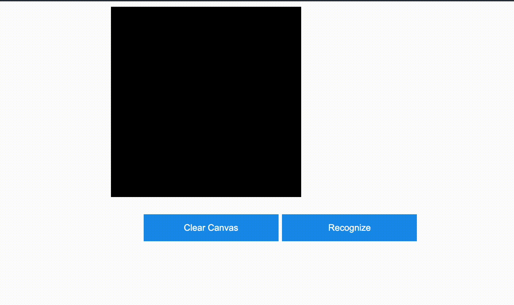

# 基于LeNet的手写数字识别系统

本repo的宗旨是用**最简单**的代码来实现一个手写数字识别系统，目的在于帮助初学者快速上手卷积神经网络(CNN)。

“乱花渐欲迷人眼 浅草才能没马蹄”

## 效果演示


## 运行本repo
1. clone 本repo到本地，目录结构如下
```
.
├── demo.gif
├── handwritten.model
├── handwritten_reg.html
├── http_for_handwritten_reg.py
├── LeNet.py
├── README.md
└── requirements.txt

1 directories, 7 files
```
2. 安装依赖
```
pip install -r requirements.txt
```
3. Run服务
```
python http_for_handwritten_reg.py
```
打开```http://127.0.0.1:5000```即可

## 代码解释
1. 神经网络模型基于LeNet。本repo提供一个已经预先训练好的模型`handwritten.model`, 是在Google Colab上训练的，跑了10个epoch，准确度为98%。如果你想重新训练，运行```LeNet.py```
    ```
    python LeNet.py
    ```
    训练完成会save模型到本地，再将http服务中的模型替换为你自己的就可以了
    ```python
    # LeNet.py
    # './model'为你训练的模型的名称
    torch.save(net.state_dict(), './model')

    # http_for_handwritten_reg.py
    # 将'./handwritten.model'替换为你自己的模型
    model.load_state_dict(
        torch.load(
            './handwritten.model',
            map_location=torch.device(device)
        )
    )
    ```
    LeNet是比较早期的CNN模型，比较简单，只包含了2个卷积层、2个池化层、3个全连接层， 但在当时却取得了非常不错的效果。

    Read More: [Wikipedia](https://en.wikipedia.org/wiki/LeNet#:~:text=In%20general%2C%20LeNet%20refers%20to,in%20large%2Dscale%20image%20processing), [Paper](http://vision.stanford.edu/cs598_spring07/papers/Lecun98.pdf)

2. 前端是用ChatGPT生成的，实现了一个简单的画布，将用户写的数字编码成784(28 x 28)位长的数组，当点击```Recognize```的时候，将这个784位的数组发送后端服务，后端服务基于训练好的模型来识别，再将识别结果返回给前端。

3. 后端基于Flask实现了一个简单的http服务，来和前端交互。